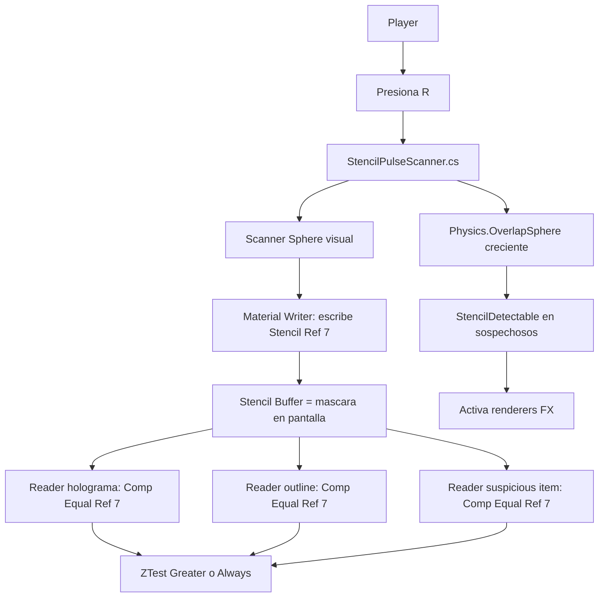

# Ejercicio 7 - Stencil Detection tipo Assassin's Creed / Batman Arkham

## Objetivo

Crear un sistema donde el player emite un pulso esferico al presionar una tecla, por ejemplo `R`. El pulso crece desde el player y funciona como una zona de deteccion. Cuando el pulso alcanza sospechosos/enemigos:

1. Los sospechosos reciben un outline visible a traves de obstaculos.
2. Los sospechosos se ven como holograma transparente.
3. El objeto interno `SuspiciousItem` se vuelve visible con un efecto especial.

La implementacion combina tres ideas:

- **Stencil Buffer** para limitar donde se dibujan los efectos en pantalla.
- **Z-buffer / ZTest** para que el holograma u outline aparezca a traves de paredes.
- **Deteccion por script** con `Physics.OverlapSphere`, porque el stencil no sabe si un objeto entro en una esfera 3D.

## Referencias tecnicas

- Unity ShaderLab Stencil: `Stencil { Ref, Comp, Pass, Fail, ZFail }`. Unity indica que el stencil es un buffer de 8 bits por pixel y permite escribir o testear valores para decidir si un pixel se dibuja.
- Amplify Shader Editor Manual: el output node expone configuracion de Stencil Buffer, donde `Reference`, `Read Mask`, `Write Mask`, `Comparison`, `Pass`, `Fail` y `ZFail` controlan escritura/lectura por pixel.
- Amplify tambien expone Depth: `ZWrite` y `ZTest`. Para efectos detras de paredes, `ZTest Greater` sirve para dibujar cuando el objeto esta mas lejos que la geometria ya dibujada.

## Arquitectura general



## Por que no alcanza solo con Stencil

El stencil buffer trabaja en pantalla, pixel por pixel. No sabe si un enemigo esta dentro de una esfera en el mundo 3D.

Por eso usamos dos capas de logica:

```text
Script / fisica:
Detecta que sospechosos entraron al radio de la esfera.

Stencil / shader:
Controla como se dibuja el efecto visual en pantalla.
```

Esta separacion te permite defenderlo mejor: el pulso es volumetrico en gameplay por `OverlapSphere`, y el look visual tipo detective vision se resuelve con stencil + z-buffer.

## Assets sugeridos

Usa tu carpeta:

```text
Assets/Deliver/Parcial2/07_Stencil/
```

Crear subcarpetas:

```text
Assets/Deliver/Parcial2/07_Stencil/Shaders
Assets/Deliver/Parcial2/07_Stencil/Materials
Assets/Deliver/Parcial2/07_Stencil/Scripts
Assets/Deliver/Parcial2/07_Stencil/Prefabs
```

Prefabs ya existentes:

```text
Assets/Deliver/Parcial2/Prefab/SuspiciousItem.prefab
Assets/Deliver/Parcial2/Prefab/Suspect_01.prefab
Assets/Deliver/Parcial2/Prefab/Suspect_01_Item.prefab
```

## Stencil IDs recomendados

Usa un valor que no choque con otros ejercicios. Por ejemplo:

```text
Scanner Pulse Stencil Ref = 7
```

En todos los shaders de este efecto usa `Reference = 7`.

## Shader 1 - Scanner Sphere Writer

Nombre sugerido:

```text
S_StencilScanner_Writer
M_StencilScanner_Writer
```

Este shader va en la esfera que crece desde el player. Su funcion principal es escribir un valor en el stencil.

### Configuracion en Amplify

Crear:

```text
Assets > Create > Shader > Amplify Surface Shader
```

O si preferis algo mas simple:

```text
Amplify Unlit Shader
```

### Output Node - Render settings

Selecciona el Output Node y configura:

```text
Shader Type: Unlit o Surface
Render Type: Transparent
Render Queue: Transparent, por ejemplo 3000
Blend Mode: Transparent / Alpha Blend
Cull Mode: Back o Off
ZWrite: Off
ZTest: Always
```

### Por que ZTest Always

Si la esfera scanner queda parcialmente tapada por paredes, con `ZTest LEqual` el writer no escribira stencil detras de esas paredes. Para una vision tipo detective, normalmente queremos que la esfera marque la pantalla aunque haya obstaculos.

Por eso:

```text
ZTest Always
```

hace que la esfera pueda escribir la mascara aunque haya geometria delante.

### Stencil Buffer en Amplify

En el Output Node, buscar la seccion Stencil Buffer y configurar:

```text
Reference: 7
Read Mask: 255
Write Mask: 255
Comparison: Always
Pass: Replace
Fail: Keep
ZFail: Keep
```

Interpretacion:

```text
Donde se renderiza la esfera, escribo 7 en el stencil buffer.
```

### Nodos visuales del pulso

Para que la esfera se vea como aureola/pulso, podes hacer esto:

```text
Fresnel -> Multiply con PulseColor -> Emission
Fresnel -> Multiply con PulseAlpha -> Opacity
```

Diagrama:

```text
[Fresnel]
    |-----------------------> [Multiply] <--- [PulseColor]
    |                              |
    |                              v
    |                         Output.Emission
    |
    v
[Multiply] <--- [PulseAlpha]
    |
    v
Output.Opacity
```

Valores sugeridos:

```text
PulseColor = cyan / blue
PulseAlpha = 0.15 a 0.35
Fresnel Power = 2 a 5
```

Si no queres que la esfera se vea y solo escriba stencil, podes dejar alpha muy bajo. Pero para la consigna conviene que se vea el pulso creciendo.

## Shader 2 - Suspect Hologram Reader

Nombre sugerido:

```text
S_Suspect_Hologram_Reader
M_Suspect_Hologram_Reader
```

Este shader se aplica a una copia del mesh del sospechoso, no al mesh normal. El mesh normal puede seguir teniendo su material comun.

### Configuracion en Amplify

```text
Shader Type: Surface o Unlit
Render Type: Transparent
Render Queue: Transparent+1, por ejemplo 3001
Blend Mode: Transparent / Alpha Blend
ZWrite: Off
ZTest: Greater o Always
Cull: Back
```

### ZTest Greater vs Always

Opcion recomendada para efecto a traves de paredes:

```text
ZTest Greater
```

Esto dibuja el holograma cuando el sospechoso esta detras de algo que ya escribio profundidad, por ejemplo una pared.

Si queres que el holograma se vea siempre, incluso cuando no esta tapado:

```text
ZTest Always
```

Para la consigna, `Greater` queda mas defendible porque usa z-buffer para detectar que esta oculto.

### Stencil Buffer

```text
Reference: 7
Read Mask: 255
Write Mask: 255
Comparison: Equal
Pass: Keep
Fail: Keep
ZFail: Keep
```

Interpretacion:

```text
Solo dibujo el holograma donde la esfera scanner escribio 7.
```

### Nodos del holograma

Diagrama simple:

```text
[HologramColor] ---> Output.Albedo
[HologramColor] ---> [Multiply con Intensity] ---> Output.Emission
[Alpha] ----------> Output.Opacity
```

Valores sugeridos:

```text
HologramColor = cyan claro
Intensity = 1 a 3
Alpha = 0.20 a 0.45
```

### Variante con Fresnel

Para que parezca mas holografico:

```text
[Fresnel] ---> [Multiply con FresnelIntensity] ---> [Add con BaseEmission] ---> Emission
```

Diagrama:

```text
[HologramColor] ---> [Multiply] <--- [BaseIntensity]
                         |
                         v
                       [Add] ---> Output.Emission
                         ^
                         |
[Fresnel] ---> [Multiply] <--- [FresnelIntensity]
```

## Shader 3 - Suspect Outline Reader

Nombre sugerido:

```text
S_Suspect_Outline_Reader
M_Suspect_Outline_Reader
```

Este shader sirve para el borde. Hay dos formas:

1. Usar el sistema de Outline de Amplify si lo tenes comodo.
2. Crear una copia del mesh un poco escalada con material de outline.

La opcion mas rapida y robusta para el parcial es una copia del mesh con material de outline.

### Configuracion del outline

```text
Shader Type: Unlit
Render Type: Transparent
Render Queue: Transparent+2, por ejemplo 3002
ZWrite: Off
ZTest: Greater o Always
Cull: Front
```

### Por que Cull Front

La tecnica de outline tipo inverse hull dibuja las caras de atras de una malla agrandada. Si escalas un duplicado del personaje un poco hacia afuera y usas `Cull Front`, se ve solo el borde exterior.

### Stencil Buffer

```text
Reference: 7
Comparison: Equal
Pass: Keep
Fail: Keep
ZFail: Keep
```

### Nodos del outline

```text
[OutlineColor] -> Output.Emission
[OutlineAlpha] -> Output.Opacity
```

Valores sugeridos:

```text
OutlineColor = rojo / naranja para sospechoso peligroso
OutlineAlpha = 0.8 a 1
```

### Setup del mesh outline

Dentro del prefab `Suspect_01_Item`:

```text
Suspect_01_Item
├── Normal Mesh Renderer       material normal
├── Hologram Mesh Renderer     mismo mesh, material M_Suspect_Hologram_Reader
├── Outline Mesh Renderer      mismo mesh, escala 1.03 o shader outline
└── SuspiciousItem             item interno
```

Al inicio, `Hologram Mesh Renderer`, `Outline Mesh Renderer` y `SuspiciousItem FX` pueden estar desactivados. El script los activa cuando el pulso los detecta.

## Shader 4 - Suspicious Item Reader

Nombre sugerido:

```text
S_SuspiciousItem_Reader
M_SuspiciousItem_Reader
```

Este shader se aplica al cubo interno o a una copia visual del cubo interno.

### Configuracion

```text
Shader Type: Unlit
Render Type: Transparent
Render Queue: Transparent+3, por ejemplo 3003
ZWrite: Off
ZTest: Always o Greater
Stencil Reference: 7
Stencil Comparison: Equal
Pass: Keep
```

### Nodos

```text
[ItemColor] -> Output.Emission
[ItemAlpha] -> Output.Opacity
```

Valores sugeridos:

```text
ItemColor = amarillo / naranja
ItemAlpha = 0.75 a 1
```

Si queres que el item sea visible incluso a traves del cuerpo del sospechoso y paredes, usa:

```text
ZTest Always
```

Si queres que solo se vea cuando esta realmente oculto por profundidad, usa:

```text
ZTest Greater
```

## Orden de render recomendado

```text
Paredes / mundo opaco:        Queue 2000
Scanner sphere writer:        Queue 3000
Hologram reader:              Queue 3001
Outline reader:               Queue 3002
Suspicious item reader:        Queue 3003
```

La regla es:

```text
Writer primero, Readers despues.
```

## Script 1 - StencilPulseScanner

Este script vive en el player o en un GameObject hijo del player. Controla la esfera que crece y detecta sospechosos con `Physics.OverlapSphere`.

```csharp
using System.Collections.Generic;
using UnityEngine;

public class StencilPulseScanner : MonoBehaviour
{
    [Header("Input")]
    [SerializeField] private KeyCode scanKey = KeyCode.R;

    [Header("Pulse")]
    [SerializeField] private Transform pulseSphere;
    [SerializeField] private float maxRadius = 12f;
    [SerializeField] private float duration = 1.2f;
    [SerializeField] private AnimationCurve radiusCurve = AnimationCurve.EaseInOut(0f, 0f, 1f, 1f);

    [Header("Detection")]
    [SerializeField] private LayerMask suspectMask;
    [SerializeField] private float revealDuration = 4f;

    private readonly Collider[] hits = new Collider[64];
    private readonly HashSet<StencilDetectable> detectedThisPulse = new HashSet<StencilDetectable>();
    private float pulseTime;
    private bool pulseActive;

    private void Awake()
    {
        if (pulseSphere != null)
            pulseSphere.gameObject.SetActive(false);
    }

    private void Update()
    {
        if (Input.GetKeyDown(scanKey))
            StartPulse();

        if (pulseActive)
            UpdatePulse();
    }

    private void StartPulse()
    {
        pulseTime = 0f;
        pulseActive = true;
        detectedThisPulse.Clear();

        if (pulseSphere != null)
        {
            pulseSphere.gameObject.SetActive(true);
            pulseSphere.position = transform.position;
            pulseSphere.localScale = Vector3.zero;
        }
    }

    private void UpdatePulse()
    {
        pulseTime += Time.deltaTime;
        float normalizedTime = Mathf.Clamp01(pulseTime / duration);
        float radius = radiusCurve.Evaluate(normalizedTime) * maxRadius;

        if (pulseSphere != null)
        {
            pulseSphere.position = transform.position;
            pulseSphere.localScale = Vector3.one * radius * 2f;
        }

        DetectSuspects(radius);

        if (normalizedTime >= 1f)
        {
            pulseActive = false;

            if (pulseSphere != null)
                pulseSphere.gameObject.SetActive(false);
        }
    }

    private void DetectSuspects(float radius)
    {
        int hitCount = Physics.OverlapSphereNonAlloc(
            transform.position,
            radius,
            hits,
            suspectMask,
            QueryTriggerInteraction.Collide
        );

        for (int i = 0; i < hitCount; i++)
        {
            StencilDetectable detectable = hits[i].GetComponentInParent<StencilDetectable>();

            if (detectable == null || detectedThisPulse.Contains(detectable))
                continue;

            detectedThisPulse.Add(detectable);
            detectable.Reveal(revealDuration);
        }
    }
}
```

## Script 2 - StencilDetectable

Este script va en `Suspect_01_Item` y opcionalmente tambien en `Suspect_01` si queres que se marque sin item.

```csharp
using UnityEngine;

public class StencilDetectable : MonoBehaviour
{
    [Header("Effect Renderers")]
    [SerializeField] private Renderer[] hologramRenderers;
    [SerializeField] private Renderer[] outlineRenderers;
    [SerializeField] private Renderer[] itemRenderers;

    private float revealTimer;

    private void Awake()
    {
        SetEffectVisible(false);
    }

    private void Update()
    {
        if (revealTimer <= 0f)
            return;

        revealTimer -= Time.deltaTime;

        if (revealTimer <= 0f)
            SetEffectVisible(false);
    }

    public void Reveal(float duration)
    {
        revealTimer = duration;
        SetEffectVisible(true);
    }

    private void SetEffectVisible(bool visible)
    {
        SetRenderersVisible(hologramRenderers, visible);
        SetRenderersVisible(outlineRenderers, visible);
        SetRenderersVisible(itemRenderers, visible);
    }

    private static void SetRenderersVisible(Renderer[] renderers, bool visible)
    {
        if (renderers == null)
            return;

        for (int i = 0; i < renderers.Length; i++)
        {
            if (renderers[i] != null)
                renderers[i].enabled = visible;
        }
    }
}
```

## Setup en Unity paso a paso

### 1. Crear layers

Crear layers:

```text
Suspect
Obstacle
```

Asignar:

```text
Suspect_01 y Suspect_01_Item -> layer Suspect
Paredes / obstaculos -> layer Default u Obstacle
```

### 2. Crear Scanner Sphere

En el player:

```text
Player
└── ScannerSphere
```

`ScannerSphere`:

```text
Mesh: Sphere
Material: M_StencilScanner_Writer
Collider: no necesario
Inicialmente desactivado
```

El script lo escala desde cero hasta `maxRadius`.

### 3. Agregar StencilPulseScanner al player

Configurar:

```text
Scan Key = R
Pulse Sphere = ScannerSphere
Max Radius = 10 a 15
Duration = 1 a 1.5
Suspect Mask = Suspect
Reveal Duration = 3 a 5
```

### 4. Preparar Suspect_01_Item

Tu prefab `Suspect_01` no tiene un solo renderer. Tiene dos `SkinnedMeshRenderer`:

```text
Suspect_01
├── body-mesh    <- SkinnedMeshRenderer del cuerpo
├── head-mesh    <- SkinnedMeshRenderer de la cabeza
└── root         <- huesos / bones
```

Por eso, si queres que el efecto cubra todo el personaje, tenes que repetir las pasadas FX para los dos meshes. No dupliques el personaje entero ni los huesos; solo duplicas los objetos visuales `body-mesh` y `head-mesh`, manteniendo que los nuevos `SkinnedMeshRenderer` usen el mismo mesh, los mismos bones y el mismo root bone que el original.

Estructura recomendada:

```text
Suspect_01_Item
├── body-mesh                  <- renderer normal, material normal
├── head-mesh                  <- renderer normal, material normal
├── body-mesh_hologram         <- copia FX del cuerpo
├── head-mesh_hologram         <- copia FX de la cabeza
├── body-mesh_outline          <- copia FX del cuerpo
├── head-mesh_outline          <- copia FX de la cabeza
├── root                       <- huesos compartidos
└── SuspiciousItem
```

- `body-mesh` y `head-mesh`: se quedan como estan, con el material normal.
- `body-mesh_hologram` y `head-mesh_hologram`: material `S_Suspect_Hologram_Reader`, renderer apagado al inicio.
- `body-mesh_outline` y `head-mesh_outline`: material `S_Suspect_Outline_Reader`, renderer apagado al inicio.
- `SuspiciousItem`: material de item reader, renderer apagado al inicio.

Duplicar los renderers es necesario porque Unity no puede renderizar el mismo `Renderer` con dos configuraciones de shader incompatibles en la misma pasada. El personaje normal necesita conservar su material opaco/comun. El holograma necesita otro shader, otra cola de render, otro stencil test, transparencia y posiblemente `ZTest Greater` o `Always`. El outline necesita todavia otra pasada, normalmente con `Cull Front` y escala apenas mayor. Son tres lecturas distintas del mismo mesh.

La idea mental es:

```text
Renderer normal   -> se ve siempre como ciudadano/personaje comun
Renderer hologram -> se prende solo cuando el pulso lo detecta
Renderer outline  -> se prende solo cuando el pulso lo detecta
Renderer item     -> se prende solo si el sospechoso tiene objeto interno
```

#### Como duplicar cada SkinnedMeshRenderer

Para `body-mesh`:

1. Duplicar el GameObject `body-mesh`.
2. Renombrarlo `body-mesh_hologram`.
3. En su `SkinnedMeshRenderer`, reemplazar el material por `S_Suspect_Hologram_Reader`.
4. Desactivar el componente `SkinnedMeshRenderer` para que arranque invisible.
5. Duplicar otra vez `body-mesh`.
6. Renombrarlo `body-mesh_outline`.
7. Reemplazar el material por `S_Suspect_Outline_Reader`.
8. Subir apenas el scale local, por ejemplo `1.03, 1.03, 1.03`, si tu shader de outline no infla vertices.
9. Desactivar el componente `SkinnedMeshRenderer`.

Repetir lo mismo para `head-mesh`:

```text
head-mesh
├── head-mesh_hologram
└── head-mesh_outline
```

En los duplicados no toques:

- `Mesh`
- `Root Bone`
- `Bones`

Tienen que quedar iguales al original para que la cabeza y el cuerpo copiados sigan la animacion / pose del mismo esqueleto.

### 5. Agregar StencilDetectable al sospechoso

En `Suspect_01_Item`:

```text
Hologram Renderers =
  body-mesh_hologram
  head-mesh_hologram

Outline Renderers =
  body-mesh_outline
  head-mesh_outline

Item Renderers =
  SuspiciousItem renderers
```

### 6. Probar

1. Poner player en escena.
2. Poner sospechosos cerca y lejos.
3. Poner paredes entre player y sospechosos.
4. Play.
5. Presionar `R`.
6. Verificar:
   - La esfera crece desde el player.
   - Cuando toca sospechosos, se activa holograma.
   - El outline se ve a traves de obstaculos.
   - El item interno se ve si el sospechoso lo tiene.

## Variante: deteccion solo visual por stencil

Si queres que el efecto dependa solo de que el enemigo quede dentro de la esfera proyectada en pantalla, podes no usar `OverlapSphere` y dejar todos los renderers Reader siempre activos. Pero eso no es una deteccion 3D real: es una coincidencia por pantalla.

Para el ejercicio, recomiendo:

```text
OverlapSphere para deteccion real.
Stencil para mascara visual.
ZTest para verlo a traves de paredes.
```

## Errores comunes

### El Reader no se ve

Revisar:

```text
Writer Reference = 7
Reader Reference = 7
Writer Pass = Replace
Reader Comparison = Equal
Writer se renderiza antes que Reader
```

### El efecto se ve en todos lados

Revisar:

```text
Reader no debe estar en Comparison Always
Debe estar en Equal
```

### No se ve a traves de paredes

Probar en Reader:

```text
ZWrite Off
ZTest Greater
```

Si aun no aparece, probar temporalmente:

```text
ZTest Always
```

### La esfera no escribe stencil detras de paredes

En el Writer probar:

```text
ZTest Always
ZWrite Off
```

### El efecto aparece antes de que llegue la esfera

Eso significa que el renderer FX esta activo sin pasar por `OverlapSphere`. Asegurate de que `StencilDetectable` apague renderers en `Awake` y que `StencilPulseScanner` sea quien llame `Reveal`.

## Defensa oral del sistema

Una explicacion posible:

> El pulso funciona en dos capas. La primera es gameplay: un `OverlapSphere` que crece desde el player detecta sospechosos dentro del radio. La segunda es visual: una esfera Writer escribe un valor en el stencil buffer, y los materiales Reader del sospechoso, el outline y el item solo se dibujan donde el stencil coincide. Para que el efecto pueda verse a traves de paredes se combina con el z-buffer usando `ZTest Greater` o `ZTest Always`, segun el caso.

## Configuracion corta de cada shader

| Shader | Rol | Stencil | Depth | Queue |
| --- | --- | --- | --- | --- |
| Scanner Writer | Escribe mascara | Ref 7, Comp Always, Pass Replace | ZWrite Off, ZTest Always | 3000 |
| Hologram Reader | Cuerpo holografico | Ref 7, Comp Equal, Pass Keep | ZWrite Off, ZTest Greater/Always | 3001 |
| Outline Reader | Borde visible | Ref 7, Comp Equal, Pass Keep | ZWrite Off, ZTest Greater/Always, Cull Front | 3002 |
| Item Reader | Objeto interno | Ref 7, Comp Equal, Pass Keep | ZWrite Off, ZTest Always | 3003 |